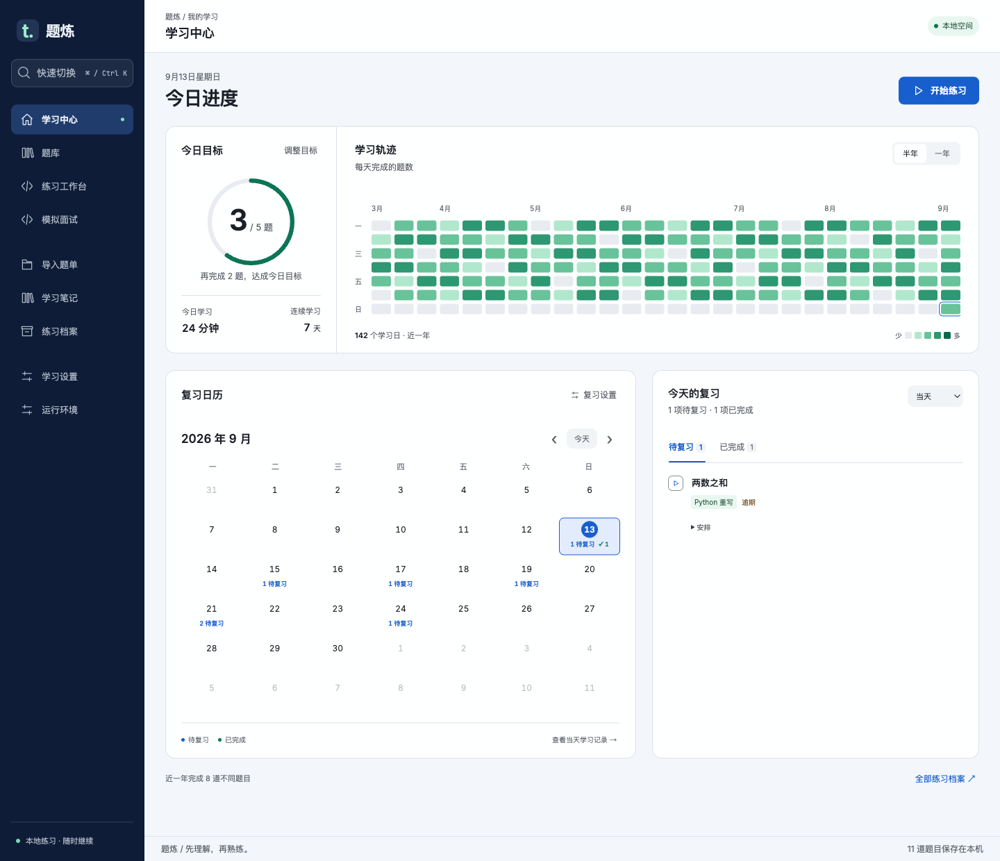

<div align="center">

# 题炼

**把做过的题，变成下次还会的题。**

离线算法练习 · 学习日历 · 渐进式 AI 辅导 · 间隔复习 · 模拟面试

[下载安装](https://github.com/xhuandy666/AlgoPractice/releases/tag/v0.6.1) · [快速开始](#三步开始练习) · [反馈问题](https://github.com/xhuandy666/AlgoPractice/issues)

</div>



*界面截图使用示例学习数据。*

**题炼是一个保存在自己电脑上的算法学习工作台。** 整理力扣题单，用 Python / Java 练习，按需获取 AI 提示，再通过笔记和间隔复习巩固掌握。无需注册题炼账号。

## 打开学习中心，看到自己的进步

每日目标、已完成题数、有效学习时长和连续学习天数集中展示。半年 / 一年热力图记录每天完成的题目，点击日期即可进入当天的练习档案，回看代码、运行结果和学习过程。

完成题数按当天已结束的练习去重统计，同一道题重复练习只计一题。学习时长仅在练习工作台处于前台且近期有操作时累计，长时间闲置和系统睡眠不计入。

复习日历按天展示待办和完成记录。选择一个日期，就能开始当天的思路复习或语言重写，也可以推迟、暂停任务，或更正此前的自评。**思路复习、Python 重写、Java 重写分别安排**，适合按自己的节奏持续巩固。

## 写代码、运行、回看，留在同一个工作台

题面、代码编辑器、测试结果与练习记录并排展示。每次运行保留当时的代码和结果，结束练习后可回看完整档案，也能从历史代码恢复一份新草稿。


需要官方完整判题时，点击 **“力扣判题”** 复制当前代码并打开官网，粘贴后由你提交。官方结果在力扣查看；题炼的本地运行使用已缓存用例，本地通过不等于官方 AC。

## AI 帮多少，由你决定

**L0–L4 分级提示**从引导问题逐步深入到完整解法。完整解法需要单独解锁；应用代码建议前可以先看差异。结束练习前，还可以让 AI 整理笔记草稿，由你确认保存。

支持 **DeepSeek、GLM、Qwen 和自定义 OpenAI 兼容接口**，使用自己的 API Key。AI 是可选项，不配置也能使用本地练习、笔记和复习。

## 整理自己的题库，离线继续练

导入力扣国服题单、收藏、题目链接，或用 CSV / JSON 添加自己的练习。题面、图片和运行环境准备好后，断网也能写代码、运行、记笔记和复习。

题库、练习档案、笔记、复习记录和附件可一起备份，迁移电脑时恢复即可。Python / Java 运行环境支持应用内安装和离线包安装。

## 用企业题单练一场模拟面试

导入企业题单，选择题数、难度与时长，开始限时训练。可选**严格模式或辅导模式**；结束后回看当时的作答记录，并把需要重练的题加入对应语言的复习。

## 下载

**v0.6.1** · 直接下载安装包，无需安装 Node.js 或下载源码。

| 你的电脑 | 安装包 | 便携归档 |
| --- | --- | --- |
| Mac · Apple Silicon（M 系列） | [下载 DMG](https://github.com/xhuandy666/AlgoPractice/releases/download/v0.6.1/AlgoPractice-0.6.1-mac-arm64.dmg) | [下载 ZIP](https://github.com/xhuandy666/AlgoPractice/releases/download/v0.6.1/AlgoPractice-0.6.1-mac-arm64.zip) |
| Mac · Intel | [下载 DMG](https://github.com/xhuandy666/AlgoPractice/releases/download/v0.6.1/AlgoPractice-0.6.1-mac-x64.dmg) | [下载 ZIP](https://github.com/xhuandy666/AlgoPractice/releases/download/v0.6.1/AlgoPractice-0.6.1-mac-x64.zip) |
| Windows · x64 | [下载安装程序](https://github.com/xhuandy666/AlgoPractice/releases/download/v0.6.1/AlgoPractice-0.6.1-win-x64.exe) | [下载 ZIP](https://github.com/xhuandy666/AlgoPractice/releases/download/v0.6.1/AlgoPractice-0.6.1-win-x64.zip) |

Mac 需要 **macOS 14 或更新版本**；Windows 需要 **Windows 10 / 11 x64**。Linux 与 Windows ARM 暂不提供安装包。版本说明见 [Release 页面](https://github.com/xhuandy666/AlgoPractice/releases/tag/v0.6.1)。

应用目前没有正式开发者签名，也未完成 Apple 公证。Mac 首次打开可能显示“Apple could not verify 题炼 is free of malware”。请从本仓库 Release 下载，并按需核对其中的 SHA-256 校验文件。

按照 [Apple 的打开说明](https://support.apple.com/zh-cn/102445)，确认下载来源后：

1. 将“题炼”拖入“应用程序”，尝试打开一次，然后关闭提示。
2. 打开 **系统设置 → 隐私与安全性**，向下找到“安全性”，在“题炼”被阻止的信息旁点击 **仍要打开**。
3. 按系统要求认证，再次确认 **打开**。之后可直接从“应用程序”或 Dock 启动。

Windows 首次打开可能出现 SmartScreen 提示。

## 三步开始练习

1. **准备运行环境。** 打开“运行环境”，分别安装 Python 和 Java；已有环境也可手动选择路径（CPython 3.14.x、完整 JDK 25）。安装不会修改系统 PATH。
2. **加入想练的题。** 打开“导入题单”，粘贴力扣国服链接，或导入 [CSV 链接示例](examples/leetcode-links.csv) / [JSON 自建练习](examples/practice.json)，预览后确认导入。
3. **开始练习。** 从学习中心进入题库，选择题目。用 `⌘ / Ctrl + Enter` 运行、`⌘ / Ctrl + K` 快速切换。结束练习后确认自评，下次从复习日历继续。

想使用 AI，在“学习设置”选择服务、填写自己的 Key 并测试连接即可。

<details>
<summary><strong>运行时下载不方便？使用离线安装包</strong></summary>

在 [Release 附件](https://github.com/xhuandy666/AlgoPractice/releases/tag/v0.6.1) 下载与你的系统和架构匹配的两个文件：

| 系统 | Python | Java |
| --- | --- | --- |
| Apple Silicon Mac | `AlgoPractice-runtime-python-darwin-arm64.tar.gz` | `AlgoPractice-runtime-java-darwin-arm64.tar.gz` |
| Intel Mac | `AlgoPractice-runtime-python-darwin-x64.tar.gz` | `AlgoPractice-runtime-java-darwin-x64.tar.gz` |
| Windows x64 | `AlgoPractice-runtime-python-win32-x64.tar.gz` | `AlgoPractice-runtime-java-win32-x64.zip` |

无需解压。在“运行环境”分别选择对应语言的“安装离线包”，应用会校验并安装。请保留下载包原样，重新压缩的归档无法通过校验。

</details>

## 常见问题

**免费吗？需要账号吗？**

题炼以 MIT 协议开源，无需注册题炼账号。AI 服务由你自行配置，费用和可用性由对应服务商决定；访问需要登录的来源时，仍需使用自己的站点账号。

**我的数据会上传到哪里？**

学习数据默认保存在本机。使用 AI 时，当前请求所需的上下文会发给你配置的服务；来源导入会访问对应站点。API Key 通过系统加密能力保存，不写入学习备份。

**能同步到另一台电脑吗？**

当前支持完整备份和恢复，暂不提供自动云同步。在“学习设置”创建 `.algobak`，然后在另一台电脑恢复。新电脑需要准备 Python / Java 运行环境，并重新配置 Key 和站点登录；数据目录可在“运行环境”查看。

**支持哪些题目和用例？**

当前支持 Python / Java。导入后能否本地运行取决于题目的输入格式和适配状态；自建 JSON 练习可以提供自己的用例及期望结果。力扣官方完整测试在原站提交时执行，题炼不下载隐藏测试集。

**输入或切换页面仍有卡顿怎么办？**

在“运行环境 → 性能诊断”开始记录，再重复卡顿时的操作。记录最多持续 90 秒，回到该页可复制报告用于反馈；报告只包含页面类型和耗时，不含代码、题目内容或 Key。

**为什么关掉窗口后还有提醒？**

关闭窗口后应用会驻留菜单栏 / 托盘，可继续发送复习提醒。完全退出后停止提醒；提醒也受系统通知权限与专注模式影响。

## 从源码运行

<details>
<summary>展开开发与构建命令</summary>

准备 Git 和 Node.js **24.17.x**（具体版本见 [.nvmrc](.nvmrc)），在 macOS / Windows 的终端执行：

```sh
git clone https://github.com/xhuandy666/AlgoPractice.git
cd AlgoPractice
npm ci
npm start
```

首次安装依赖需要联网。启动后，在应用的“运行环境”安装 Python / Java，或选择离线包。

开发检查：

```sh
npm run runtime:install
npm run typecheck
npm test
npm run build
npm run test:desktop
npm run test:learning-center
```

测试使用隔离数据目录。语言执行测试需要先完成 `npm run runtime:install`。

构建安装包：

```sh
npm run dist:mac
npm run dist:mac:intel
npm run dist:win
```

Mac 安装包请在 macOS 上构建；Windows 安装包建议在 Windows 上构建。产物位于 `release/`。

</details>

## 开源与反馈

发现问题或有想法，欢迎 [提交 Issue](https://github.com/xhuandy666/AlgoPractice/issues)。反馈时附上系统、版本和复现步骤；请勿附带 API Key 或私人学习数据。

本项目使用 [MIT License](LICENSE)。应用内的第三方组件与独立运行时遵循各自许可证，相关声明随安装包保留。
