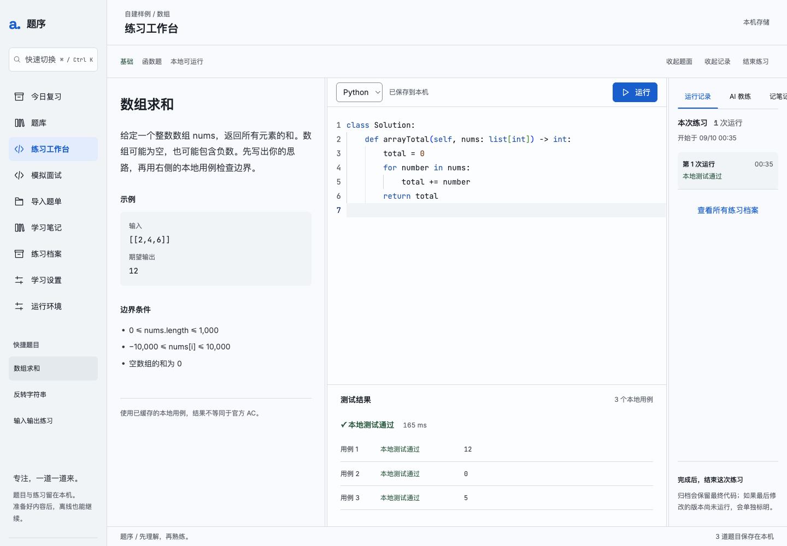
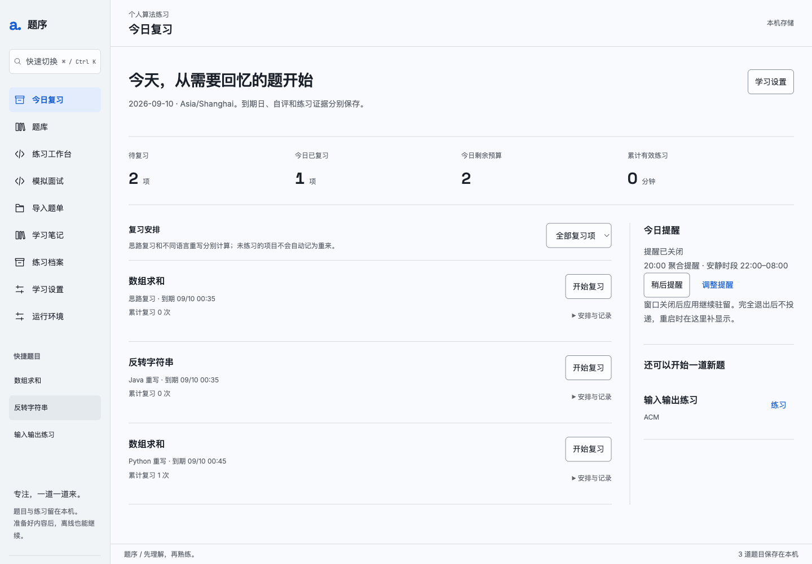

<div align="center">

# 题炼 · AlgoPractice

**把做过的题，变成下次还会的题。**

离线算法练习 · 渐进式 AI 辅导 · 间隔复习 · 模拟面试

[下载安装](https://github.com/xhuandy666/AlgoPractice/releases/tag/v0.5.1) · [快速开始](#三步开始练习) · [反馈问题](https://github.com/xhuandy666/AlgoPractice/issues)

</div>



刷题时，你可能真正缺的不是更多题目，而是：卡住时只给一点提示，做完后记住自己为什么会错，过几天再用合适的语言重写一次。

**题炼是一个保存在自己电脑上的算法学习工作台。** 你可以整理力扣题单或自建练习，用 Python / Java 写代码，让 AI 在你需要时介入，再把这次练习接到笔记、复习和面试训练中。无需注册题炼账号。

## 已经在用力扣，为什么还需要题炼？

题炼适合把力扣上的练习延续成自己的长期学习记录。它最值得一试的是下面这些连在一起的体验：

### 卡住时，先要提示，再决定看多少答案

AI 帮助分为 **L0–L4**：从引导问题逐步深入到完整解法，由你决定求助深度。完整解法需要单独解锁；建议修改代码时，可以先看差异，再决定应用。结束练习前，你可以主动让 AI 把过程整理为笔记草稿，经过确认才成为正式记录。

支持 **DeepSeek、GLM、Qwen 预设及自定义 OpenAI 兼容接口**，使用你自己的 API Key。你可以选择熟悉的服务和模型，并自己控制调用开销。

### “思路记得”与“代码还会写”，分别复习

理解过一题，不等于下次能独立写出来。题炼把 **思路复习、Python 重写、Java 重写** 分开安排；同一题可以在不同语言上处于不同进度。

完成练习后确认自评，系统据此安排下一次复习。你可以设置每日预算、推迟或暂停，也能更正误选的评分。打开“今日”，就能看到接下来该练什么。



### 回看当时的代码，而不只是最后留下的版本

每次运行都保留当时的代码、用例和结果；笔记可以回看历史版本。之后继续改代码，也不会覆盖先前那次练习的记录。复盘时可以回到具体过程，理解自己是在哪里想通、在哪里出错。

### 自己的题库、自己的节奏，断网也能练

导入力扣国服题单、收藏、题目链接，或用 CSV / JSON 添加自己的练习。导入前先预览，缓存题面和图片后，在本地完成写代码、运行、记笔记与复习。

Python / Java 运行环境可以在应用里安装，也可以用离线安装包准备。题库、笔记、复习记录和附件支持完整备份与恢复，方便迁移电脑。

### 把企业题单变成一次限时模拟面试

导入企业题单、检查可用题池，再开始限时训练。可选 **严格模式或辅导模式**；结束后回看冻结的作答记录，并把需要重练的题加入对应语言的复习。

> 题炼侧重个人学习闭环。力扣仍提供官方判题、竞赛与社区等服务；题炼中的本地用例通过，不代表力扣官方 AC。功能介绍针对题炼当前实现，不作“其他平台绝对没有”的承诺。

## 下载

当前公开测试版：**v0.5.1**。普通用户直接下载安装包，无需安装 Node.js 或下载源码。

| 你的电脑 | 安装包 | 便携归档 |
| --- | --- | --- |
| Mac · Apple Silicon（M 系列） | [下载 DMG](https://github.com/xhuandy666/AlgoPractice/releases/download/v0.5.1/AlgoPractice-0.5.1-mac-arm64.dmg) | [下载 ZIP](https://github.com/xhuandy666/AlgoPractice/releases/download/v0.5.1/AlgoPractice-0.5.1-mac-arm64.zip) |
| Mac · Intel | [下载 DMG](https://github.com/xhuandy666/AlgoPractice/releases/download/v0.5.1/AlgoPractice-0.5.1-mac-x64.dmg) | [下载 ZIP](https://github.com/xhuandy666/AlgoPractice/releases/download/v0.5.1/AlgoPractice-0.5.1-mac-x64.zip) |
| Windows · x64 | [下载安装程序](https://github.com/xhuandy666/AlgoPractice/releases/download/v0.5.1/AlgoPractice-0.5.1-win-x64.exe) | [下载 ZIP](https://github.com/xhuandy666/AlgoPractice/releases/download/v0.5.1/AlgoPractice-0.5.1-win-x64.zip) |

Mac 需要 **macOS 14 或更新版本**；Windows 需要 **Windows 10 / 11 x64**。Linux 与 Windows ARM 暂不提供安装包。各平台的实际验证范围见 [Release 说明](https://github.com/xhuandy666/AlgoPractice/releases/tag/v0.5.1)。

应用目前没有正式开发者签名，也未完成 Apple 公证，首次打开可能出现系统提示。Mac 用户可以在核对下载来源后，按照 [Apple 的打开说明](https://support.apple.com/zh-cn/102445) 从“系统设置 → 隐私与安全性”选择“仍要打开”；Windows 可能出现 SmartScreen 提示。请从本仓库 Release 下载，并按需核对其中的 SHA-256 校验文件。

## 三步开始练习

1. **准备运行环境。** 打开应用中的“运行环境”，分别安装 Python 和 Java；已有环境也可手动选择路径（CPython 3.14.x、完整 JDK 25）。安装不会修改系统 PATH。
2. **加入想练的题。** 打开“导入题单”，粘贴力扣国服来源，或导入 [CSV 链接示例](examples/leetcode-links.csv) / [JSON 自建练习](examples/practice.json)。查看预览后确认导入。
3. **开始练，再安排下一次。** 进入工作台，用 `⌘ / Ctrl + Enter` 运行、`⌘ / Ctrl + K` 快速切换题目。结束后留下笔记、确认自评，之后从“今日”继续复习。

想使用 AI，再到“学习设置”选择服务、填写自己的 Key 并测试连接。**AI 是可选项，不配置也能使用本地练习、笔记和复习。**

<details>
<summary><strong>运行时下载不方便？使用离线安装包</strong></summary>

在 [Release 附件](https://github.com/xhuandy666/AlgoPractice/releases/tag/v0.5.1) 下载与你的系统和架构匹配的两个文件：

| 系统 | Python | Java |
| --- | --- | --- |
| Apple Silicon Mac | `AlgoPractice-runtime-python-darwin-arm64.tar.gz` | `AlgoPractice-runtime-java-darwin-arm64.tar.gz` |
| Intel Mac | `AlgoPractice-runtime-python-darwin-x64.tar.gz` | `AlgoPractice-runtime-java-darwin-x64.tar.gz` |
| Windows x64 | `AlgoPractice-runtime-python-win32-x64.tar.gz` | `AlgoPractice-runtime-java-win32-x64.zip` |

无需解压。在“运行环境”分别选择对应语言的“安装离线包”，应用会校验并安装。请保留下载包原样，重新压缩的归档无法通过校验。

</details>

## 常见问题

**免费吗？需要账号吗？**  
题炼本身以 MIT 协议开源，无需注册题炼账号。AI 服务由你自行配置，费用和可用性由对应服务商决定；访问需要登录的来源时，仍需使用自己的站点账号。

**哪些操作需要联网？**  
首次下载安装包、在线安装运行时、导入远程题目和调用远程 AI 需要联网。题面、图片及运行时准备好之后，本地练习、笔记、复习和已有记录可以离线使用。

**我的数据会上传到哪里？**  
学习数据默认保存在本机。使用 AI 时，当前请求所需的上下文会发给你配置的服务；来源导入会访问对应站点。API Key 通过系统加密能力保存，不写入学习备份；换电脑或恢复备份后需要重新配置 Key 和站点登录。

**能同步到另一台电脑吗？**  
当前提供完整备份和恢复，暂不提供自动云同步。在“学习设置”创建 `.algobak`，然后在另一台电脑恢复；新电脑仍需准备 Python / Java 运行环境，并重新配置 Key 和站点登录。数据目录可在“运行环境”查看。

**支持哪些题目和语言？**  
当前支持 Python / Java。导入后能否直接运行取决于题目签名、输入格式和适配状态；可在工作台检查和补充用例。暂不替代在线判题平台的全部题型与测试数据。

**为什么关掉窗口后还有提醒？**  
关闭窗口后应用会驻留菜单栏 / 托盘，可继续发送复习提醒。完全退出后停止提醒；提醒也受系统通知权限与专注模式影响。

## 从源码运行

<details>
<summary>展开安装与检查命令</summary>

准备 Git 和 Node.js **24.17.x**（具体版本见 [.nvmrc](.nvmrc)），在 macOS / Windows 的终端执行：

```sh
git clone https://github.com/xhuandy666/AlgoPractice.git
cd AlgoPractice
npm ci
npm start
```

首次安装依赖需要联网。启动后，在应用的“运行环境”安装 Python / Java，或选择离线包。

检查源码及桌面启动：

```sh
npm run runtime:install
npm run typecheck
npm test
npm run build
npm run test:desktop
```

测试使用隔离数据目录。`npm test` 的语言执行测试需要先完成 `npm run runtime:install`；不同操作系统的专属测试会按平台运行。

构建安装包：

```sh
npm run dist:mac
npm run dist:mac:intel
npm run dist:win
```

Mac 安装包请在 macOS 上构建；Windows 安装包建议在 Windows 上构建。产物位于 `release/`。

</details>

## 开源与反馈

发现问题或有想法，欢迎 [提交 Issue](https://github.com/xhuandy666/AlgoPractice/issues)。反馈时附上系统、版本和复现步骤；请勿附带 API Key 或私人学习数据。

本项目使用 [MIT License](LICENSE)。应用内的第三方组件与独立运行时遵循各自许可证，相关声明随安装包保留。
