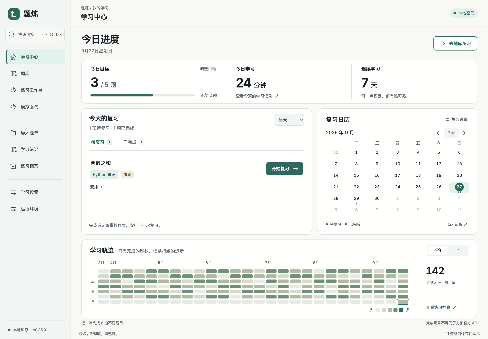
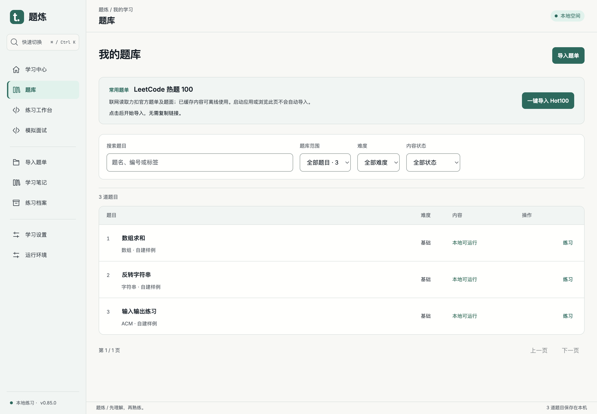
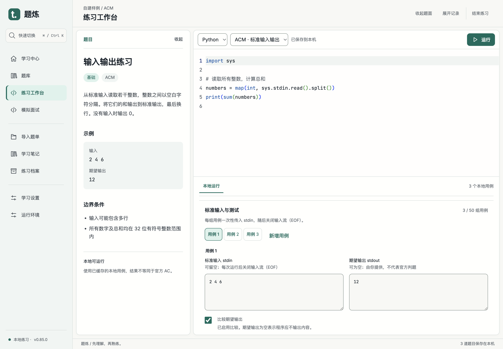
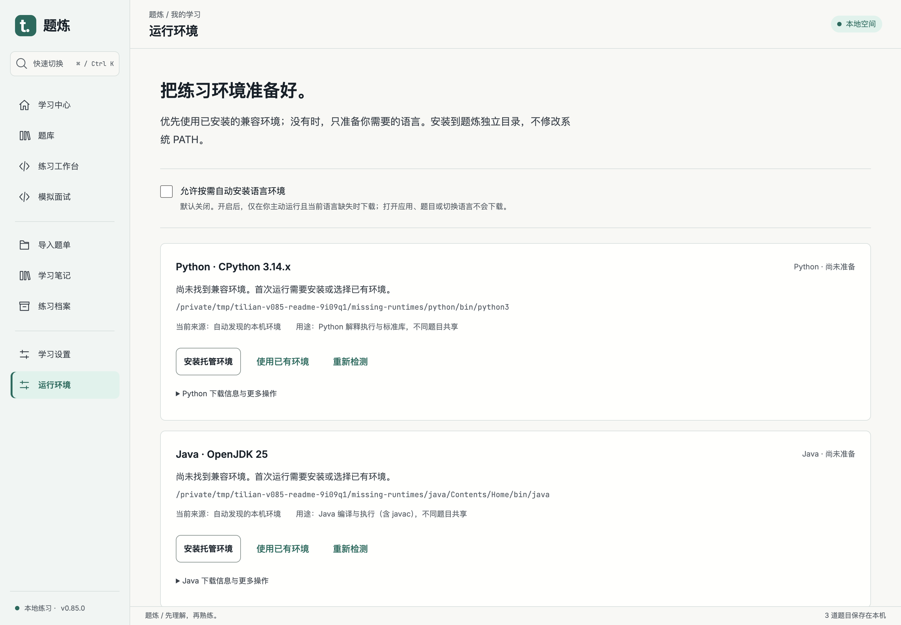

<div align="center">

# 题炼

**把做过的题，变成下次还会的题。**

为校招和算法面试，把刷题、复盘与复习放进一个本地工作台。

[下载安装](https://github.com/xhuandy666/AlgoPractice/releases/latest) · [快速开始](#三步开始练习) · [反馈问题](https://github.com/xhuandy666/AlgoPractice/issues)

</div>

**已有力扣，也可以多一个整理学习过程的地方。** 继续用力扣获取题目、完成官方判题；题炼把练习 → 诊断 → 笔记 → 复习 → 模拟面试串起来，让你回看哪里卡住、安排下次重练，再用限时训练检验掌握情况。

## 为什么不只用力扣？

题炼不是要替代力扣。它适合想把练习节奏、AI 服务和学习积累更多掌握在自己手里的同学：

| 你想解决的问题 | 题炼提供的选择 |
| --- | --- |
| **按自己的需要使用 AI** | 本地练习、复习和自建模拟面试无需额外题炼订阅。AI 可选，自带 Key，是否启用、选哪家服务由你决定；费用按服务商规则计算。 |
| **给自己安排一场限时训练** | 用自己导入的题目或企业题单，按题数、难度和时长抽题。严格模式独立作答，辅导模式按需求助，结束后回看当时的代码与结果。 |
| **知道今天该复习哪几题** | 按掌握程度自评，生成题目级安排和每日推荐量；支持延期、暂停、补评与评分更正，不只记录“做过”。 |
| **从函数题练到笔试输入输出** | 普通练习可自由切换函数式 / ACM，用完整 stdin / stdout 程序练习；Python、Java 及两种格式分别保存草稿。 |
| **把复盘留在同一个地方** | 代码、运行与官方提交记录、题目笔记和复习历史放在同一个工作台。本机保存、完整备份，无需注册题炼账号。 |




*界面截图使用示例学习数据、判题结果和辅导内容，保留旧版界面作功能示意，并非 v0.90.0 截图；当前操作以本文说明为准。*

## 少一些准备，直接开始练习

在题库点击 **“一键导入 Hot100”**，即可读取[力扣官方热题 100](https://leetcode.cn/studyplan/top-100-liked/)并逐题缓存，不用再寻找和粘贴题单链接。支持暂停、继续和失败重试；已有同源题单直接复用，用户移出的题目不会因重启或继续任务被重新加入。



首次导入需要联网，已缓存内容可离线阅读。应用不携带完整 Hot100 题面，不下载隐藏测试集，也不绕过登录、会员权限或站点验证。

## 打开学习中心，看到自己的进步

每日目标、已完成题数、有效学习时长和连续学习天数集中展示。半年 / 一年热力图记录每天完成的题目，点击日期即可进入当天的练习档案，回看代码、运行结果和学习过程。

完成题数按当天已结束的练习去重统计，同一道题重复练习只计一题。学习时长仅在练习工作台处于前台且近期有操作时累计，长时间闲置和系统睡眠不计入。

**复习以题目为单位**，思路回忆、Python 和 Java 重做共用一份计划。在“复习计划”添加题目，完成首次自评后生成后续安排；可以按今日推荐开始，也可以主动回忆或重做后记录自评。计划支持每日推荐量、延期、暂停、评分历史与更正，日历可查看各日安排。

普通练习中，同一道题在当前学习日首次力扣官方 AC、且当天尚未自评时，会在前台工作台提示自评。选择“稍后再评”后，可从复习计划的“待补自评”补填；本地运行通过不会触发该提示。

## 写代码、运行、回看，留在同一个工作台

题面、代码编辑器、测试结果与练习记录并排展示。每次运行保留当时的代码和结果，结束练习后可回看完整档案，也能从历史代码恢复一份新草稿。

在工作台直接打开题目笔记，边练习边记录思路，草稿自动保存。提交历史同时收录本地运行和官方提交，可只读回看代码、比较差异，并给记录添加备注；历史代码不会因回看而被覆盖。

进入练习时，导航自动收为紧凑侧栏，也可手动展开或收起。工作台的三个分隔条支持拖拽，聚焦后可用方向键调整；需要时可重置布局。

“上一题 / 下一题”沿进入时的题单或复习来源顺序浏览，顺序在进入时固定，不会因后续筛选改变。也可使用 `Alt + ← / →`，编辑器和输入框内不触发切题。浏览相邻题目不会推进复习队列；本轮复习仍需通过“已自评，下一题”或“跳过本题”确认进度。

普通练习可自由选择 **函数式 / ACM**。Python 与 Java 的两种格式分别保存代码；ACM 支持多组标准输入、可选期望输出和比较规则。切换格式不会覆盖另一份草稿；没有填写期望输出时，结果只表示“运行完成”，不会冒充“通过”。



登录力扣国服后，在工作台点击 **“提交到力扣”**，即可提交当前 Python / Java 代码，在题炼查看官方判题结果、返回的通过用例数及错误信息。每次提交保存代码快照，也能在练习档案中回看。

本地运行和官方判题分别显示。题炼不下载隐藏测试集；官方返回多少信息，就展示多少。遇到登录过期或站点验证时，在独立登录窗口处理后再继续；已有提交编号的中断查询可以恢复，不会自动重复提交代码。

## AI 教练，围绕你的作答提供帮助

点击 **“给点提示”** 获取下一步线索，或点击 **“检查代码”** 分析当前作答。AI 会结合题面、代码和对应的编译、运行或官方判题结果，解释问题并建议修改；代码通过后，也可以复盘思路和复杂度。

输入框是可选的。想只要提示、解释某段代码，或查看完整解法，写下需求即可。代码建议仍需你预览差异后应用；练习结束前，还可以让 AI 整理笔记草稿，由你确认保存。

开启 **“提交后自动分析”** 后，仅在力扣官方提交完成时分析该次提交反馈，本地运行不会自动触发。开关旁的问号可悬停或聚焦查看说明。

回答中的运行和提交引用必须来自该次可核对的记录，官方反馈对应提交时的代码快照。格式或引用校验失败时，系统会自动尝试修复一次；仍无法核对的回答会显示具体原因，可重试或反馈。

支持 **DeepSeek、GLM、Qwen 和自定义 OpenAI 兼容接口**，使用自己的 API Key。AI 是可选项，不配置也能使用本地练习、笔记和复习。服务商按其规则收费，题炼不保证比会员方案更便宜，也不承诺 AI 永久免费。

## 整理自己的题库，离线继续练

导入力扣国服题单、收藏、题目链接，或用 CSV / JSON 添加自己的练习。题面、图片和运行环境准备好后，断网也能写代码、运行、记笔记和复习。

题库、练习档案、笔记、复习记录和附件可一起备份，迁移电脑时恢复即可。Python / Java 运行环境支持应用内安装和离线包安装。

点击运行时，题炼先检测本机兼容环境。缺少环境时，可选择 **安装并运行**、已有环境或离线包；仅准备当前需要的语言，不修改系统 PATH。Python/JDK 不随应用安装包打包，“按需自动安装”默认关闭，由你决定是否开启。



## 按面试节奏，做一场限时训练

用自己已导入的题目或企业题单，选择题数、难度与时长，按需抽题并计时作答。**严格模式**限制 AI、旧答案和笔记等帮助入口，适合检验独立解题；**辅导模式**适合边练边学。结束后回看当时的作答记录，再将需要巩固的题添加到题目级复习计划。

自建模拟训练不需要额外题炼订阅，但不附赠或解锁力扣会员题库、企业模拟面试等站点权益；题源访问仍遵循你的账号权限。

## 下载

**v0.90.0** · 题目级复习与自评、AI 证据引用修复、紧凑侧栏、可调整工作台和题单相邻题导航。直接下载安装包，无需安装 Node.js 或下载源码。

| 你的电脑 | 安装包 | 便携归档 |
| --- | --- | --- |
| Mac · Apple Silicon（M 系列） | [下载 DMG](https://github.com/xhuandy666/AlgoPractice/releases/download/v0.90.0/AlgoPractice-0.90.0-mac-arm64.dmg) | [下载 ZIP](https://github.com/xhuandy666/AlgoPractice/releases/download/v0.90.0/AlgoPractice-0.90.0-mac-arm64.zip) |
| Mac · Intel | [下载 DMG](https://github.com/xhuandy666/AlgoPractice/releases/download/v0.90.0/AlgoPractice-0.90.0-mac-x64.dmg) | [下载 ZIP](https://github.com/xhuandy666/AlgoPractice/releases/download/v0.90.0/AlgoPractice-0.90.0-mac-x64.zip) |
| Windows · x64 | [下载安装程序](https://github.com/xhuandy666/AlgoPractice/releases/download/v0.90.0/AlgoPractice-0.90.0-win-x64.exe) | [下载 ZIP](https://github.com/xhuandy666/AlgoPractice/releases/download/v0.90.0/AlgoPractice-0.90.0-win-x64.zip) |

Mac 需要 **macOS 14 或更新版本**；Windows 需要 **Windows 10 / 11 x64**。Linux 与 Windows ARM 暂不提供安装包。版本说明见 [Release 页面](https://github.com/xhuandy666/AlgoPractice/releases/tag/v0.90.0)。

应用目前没有正式开发者签名，也未完成 Apple 公证。Mac 首次打开可能显示“Apple could not verify 题炼 is free of malware”。请从本仓库 Release 下载，并按需核对其中的 SHA-256 校验文件。

按照 [Apple 的打开说明](https://support.apple.com/zh-cn/102445)，确认下载来源后：

1. 将“题炼”拖入“应用程序”，尝试打开一次，然后关闭提示。
2. 打开 **系统设置 → 隐私与安全性**，向下找到“安全性”，在“题炼”被阻止的信息旁点击 **仍要打开**。
3. 按系统要求认证，再次确认 **打开**。之后可直接从“应用程序”或 Dock 启动。

Windows 首次打开可能出现 SmartScreen 提示。

## 三步开始练习

1. **加入想练的题。** 在题库点击“一键导入 Hot100”；也可粘贴力扣链接，或导入 [CSV 链接示例](examples/leetcode-links.csv) / [JSON 自建练习](examples/practice.json)。
2. **选择语言和答题格式。** 打开题目，选择 Python / Java 与函数式 / ACM，开始写代码。ACM 的标准输入与期望输出由你设置，不自动转换官方用例。
3. **运行并复习。** 用 `⌘ / Ctrl + Enter` 运行。缺少环境时按提示安装，或选择已有环境（CPython 3.14.x、完整 JDK 25）。需要官方判题时点击“提交到力扣”；官方 AC 后按提示自评，或在“复习计划”主动添加题目、记录自评，下次按到期安排继续。

想使用 AI，在“学习设置”选择服务、填写自己的 Key 并测试连接即可。

### v0.90.0 使用说明

- 复习按题目维护一份计划。主动自评和当前学习日首次官方 AC 后的自评共用该计划；错过提示可从“待补自评”继续，已记录评分可在历史中更正。
- 进入练习自动收起导航；工作台三个分隔条可拖拽或用键盘调整，也可重置布局。相邻题按钮及 `Alt + ← / →` 使用进入时固定的来源顺序；切题浏览不等于完成本轮复习，输入区域内不触发快捷键。
- AI 教练提供“给点提示”“检查代码”和对话提问。官方自动分析仅由已完成的官方提交触发；回答引用经过核对，校验失败最多自动修复一次，代码修改仍需预览确认。
- 题库和导入页内置 **“一键导入 Hot100”**，无需寻找或粘贴链接。点击后从[力扣官方热题 100](https://leetcode.cn/studyplan/top-100-liked/)读取题单并逐题缓存；可暂停、继续和重试。已有同源题单直接复用，更新成员仍需显式预览确认。
- 点击运行前检测本机兼容环境；缺少环境时原位选择“安装并运行”、已有环境或离线包。只准备需要的语言，Python/JDK 不随应用打包；按需自动安装默认关闭。环境准备失败与代码编译失败分开显示。
- 安装期间可以继续编辑。修改代码或输入、切换题目/语言/格式、结束练习或关闭窗口后，旧请求不会自动执行，环境就绪后请重新运行。
- 普通工作台可选择函数式或 ACM，分别保存每种语言的代码与输入。ACM 支持多组 stdin、可选期望输出与精确/归一化比较；没有期望输出时只表示运行完成，不代表通过。自由 ACM 的输入约定和自定义期望不属于力扣官方判题。
- 历史记录保留原格式与测试快照；ACM 不能直接提交到力扣。模拟面试暂保留题目原生格式，不在计时中切换格式。
- 语言环境始终在本机执行，不是文件或网络沙箱。请只运行理解且信任的代码。新设备首次断网且没有环境时只能阅读与编辑，不能执行。

升级首次启动会备份并迁移学习数据库；不要用旧版直接打开升级后的数据库。需要降级时使用升级前备份，并保留新数据副本。Hot100 是官方题单导入快捷入口，不是随安装包分发完整题面；首次导入需要联网，未缓存内容不能离线阅读。

<details>
<summary><strong>运行时下载不方便？使用离线安装包</strong></summary>

在 [Release 附件](https://github.com/xhuandy666/AlgoPractice/releases/tag/v0.90.0) 下载你需要的语言所对应的文件（系统和架构必须匹配）：

| 系统 | Python | Java |
| --- | --- | --- |
| Apple Silicon Mac | [Python 离线包](https://github.com/xhuandy666/AlgoPractice/releases/download/v0.90.0/AlgoPractice-runtime-python-darwin-arm64.tar.gz) | [Java 离线包](https://github.com/xhuandy666/AlgoPractice/releases/download/v0.90.0/AlgoPractice-runtime-java-darwin-arm64.tar.gz) |
| Intel Mac | [Python 离线包](https://github.com/xhuandy666/AlgoPractice/releases/download/v0.90.0/AlgoPractice-runtime-python-darwin-x64.tar.gz) | [Java 离线包](https://github.com/xhuandy666/AlgoPractice/releases/download/v0.90.0/AlgoPractice-runtime-java-darwin-x64.tar.gz) |
| Windows x64 | [Python 离线包](https://github.com/xhuandy666/AlgoPractice/releases/download/v0.90.0/AlgoPractice-runtime-python-win32-x64.tar.gz) | [Java 离线包](https://github.com/xhuandy666/AlgoPractice/releases/download/v0.90.0/AlgoPractice-runtime-java-win32-x64.zip) |

无需解压。在“运行环境”分别选择对应语言的“安装离线包”，应用会校验并安装。请保留下载包原样，重新压缩的归档无法通过校验。

</details>

## 常见问题

**免费吗？需要账号吗？**

题炼以 MIT 协议开源，无需注册题炼账号。本地练习、复习和自建模拟面试不需要额外题炼订阅；AI 服务可选，由你自行配置 Key，费用和可用性由服务商决定，不保证更便宜或永久免费。访问需要登录或会员权限的题源时，仍需使用自己的站点账号。

**我的数据会上传到哪里？**

学习数据默认保存在本机。使用 AI 时，当前请求所需的上下文会发给你配置的服务；来源导入会访问对应站点；点击“提交到力扣”会将当时的代码和语言发送到力扣国服，并在你的力扣账号中留下提交记录。API Key 通过系统加密能力保存，不写入学习备份。

**能同步到另一台电脑吗？**

当前支持完整备份和恢复，暂不提供自动云同步。在“学习设置”创建 `.algobak`，然后在另一台电脑恢复。新电脑需要准备 Python / Java 运行环境，并重新配置 Key 和站点登录；数据目录可在“运行环境”查看。

**支持哪些题目和用例？**

当前支持 Python / Java。导入后能否本地运行取决于题目的输入格式和适配状态；自建 JSON 练习可以提供自己的用例及期望结果。官方提交支持已导入且具备对应语言模板的国服函数题，在普通练习中进行。官方完整测试在力扣执行，题炼通过国服登录会话提交并读取结果，不下载隐藏测试集。该连接使用站点当前的网页接口，可用性取决于力扣接口、账号权限和验证要求。

**输入或切换页面仍有卡顿怎么办？**

在“运行环境 → 性能诊断”开始记录，再重复卡顿时的操作。记录最多持续 90 秒，回到该页可复制报告用于反馈；报告只包含页面类型和耗时，不含代码、题目内容或 Key。

**为什么关掉窗口后还有提醒？**

关闭窗口后应用会驻留菜单栏 / 托盘，可继续发送复习提醒。完全退出后停止提醒；提醒也受系统通知权限与专注模式影响。

## 从源码运行

<details>
<summary>展开开发与构建命令</summary>

准备 Git 和 Node.js **24.17.x**（具体版本见 [.nvmrc](.nvmrc)），在 macOS / Windows 的终端执行：

```sh
git clone https://github.com/xhuandy666/AlgoPractice.git
cd AlgoPractice
npm ci
npm start
```

首次安装依赖需要联网。启动后，在应用的“运行环境”安装 Python / Java，或选择离线包。

开发检查：

```sh
npm run runtime:install
npm run typecheck
npm test
npm run build
npm run test:desktop
npm run test:learning-center
npm run test:reviews
npm run test:official
npm run test:ai
npm run test:workbench
npm run test:workbench-navigation
npm run test:onboarding
npm run test:acm
npm run test:hot100
```

测试使用隔离数据目录。语言执行测试需要先完成 `npm run runtime:install`。

构建安装包：

```sh
npm run dist:mac
npm run dist:mac:intel
npm run dist:win
```

Mac 安装包请在 macOS 上构建；Windows 安装包建议在 Windows 上构建。产物位于 `release/`。

</details>

## 开源与反馈

发现问题或有想法，欢迎 [提交 Issue](https://github.com/xhuandy666/AlgoPractice/issues)。反馈时附上系统、版本和复现步骤；请勿附带 API Key 或私人学习数据。

本项目使用 [MIT License](LICENSE)。应用内的第三方组件与独立运行时遵循各自许可证，相关声明随安装包保留。
